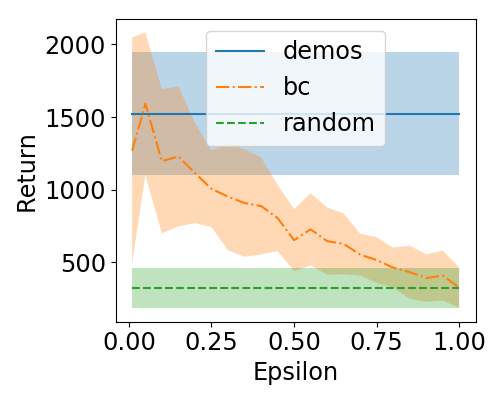

# D-REX Project Page

## Abstract
The performance of imitation learning is typically upper bounded by the performance of the demonstrator. Recent empirical results show that imitation learning via ranked demonstrations allows for better-than-demonstrator performance; however, ranked demonstrations may be difficult to obtain, and little is known theoretically about when such methods can be expected to outperform the demonstrator. To address these issues, we first contribute a sufficient condition for when better-than-demonstrator performance is possible and provide theoretical results showing why ranked demonstrations can contribute to better-than-demonstrator performance. Building on this theory, we then introduce Disturbance-based Reward Extrapolation (D-REX), a ranking-based imitation learning method that injects noise into a policy learned through behavioral cloning to automatically generate ranked demonstrations. By generating rankings automatically, ranking-based imitation learning can be applied in traditional imitation learning settings where only unlabeled demonstrations are available. We empirically validate our approach on simulated robot and Atari imitation learning benchmarks and show that D-REX can utilize automatic rankings to significantly surpass the performance of the demonstrator and outperform standard imitation learning approaches. D-REX is the first imitation learning approach to achieve significant extrapolation beyond the demonstrator's performance without additional side-information or supervision, such as rewards or human preferences. 

## Motivation
Imitation learning, the ability to learn how to perform a task by observing demonstrations, is something that humans are quite good at and something that we as humans do all the time. However, getting robots and other autonomous agents to use imitation learning to learn new tasks is often challenging. One common approach for imitation learning focuses on direct imitation through mimicry (often called "behavioral cloning"), where the robot looks at what the demonstrator does and tries to learn to copy the demonstrator. Another popular approach (often called "inverse reinforcement learning") involves reward inference, where the goal is to find a reward function that makes what the demonstrator did achieve a higher cumulative reward than anything else the demonstrator could have done. Once a reward is inferred from the demonstrations, the agent can optimize its own behavior to maximize the learned reward and hopefully generalize better to unseen states than a policy learned via behavioral cloning. While both approaches make sense, and have proven useful in practice, they have the effect of essentially capping the performance of the learning agent. This is because both behavioral cloning and inverse reinforcement learning try to make the learning agent perform the task as close as possible to how the demonstrator performed the task. This is fine if the demonstrator is good at the task, but what if we want our learning agents to be able to learn to perform better than a suboptimal demonstrator? Is it possible for an agent to figure out what the demonstrator was trying to do, perhaps unsuccessfully, and then figure out how to do the task better?

In previous work, we developed an algorithm called [T-REX](http://dev.wonjoon.me/ICML2019-TREX/) (Trajectory-ranked Reward Extrapolation) that takes a set of preference rankings over demonstrations and then learns a reward function that explains the rankings, but allows for the potential to extrapolate beyond the performance of the demonstrator. This actually works really well, making reward inference fast and allowing for better-than-demonstrator performance for complex imitation learning policies from raw visual inputs. However, what if rankings or pairwise preferences are not available? Maybe demonstrations are of similar quality or maybe our robot just went to YouTube and downloaded some videos of how to perform a task but doesn't know the relative performance quality of the demonstrations. In these and many other cases, the agent is just given a set of unlabeled demonstrations to learn from. So, the question we wanted to answer in this project is if there is any way for an agent to learn better-than-demonstrator performance without access to a ground-truth reward signal, active queries, or human labels.

## Rankings without rankings
Our idea was to automatically generate preferences over demonstrations without requiring human input. Given rankings or pairwise preferences over demonstrations we can apply [T-REX](http://dev.wonjoon.me/ICML2019-TREX/) to hopefully learn how to perform the task better than the demonstrator. The approach we came up with combines behavioral cloning with inverse reinforcement learning from preferences. We first take our set of unlabeled demonstrations and run behavioral cloning. This essentially amounts to running supervised learning, where we take each state $s_t$ that the demonstrator was in and the action that the demonstrator took $a_t$ and create supervised training pairs for a regression (continuous actions) or classification (discrete actions) problem. Since we want an algorithm that can work with raw visual observations of the state, we train a deep neural network $\pi_{\rm BC}$ to map from states $s_t$ to actions $a_t$. After training we can run our behavioral cloned policy $\pi_{\rm BC}$ by taking the action at each state that is predicted by our neural network.

The above process gives us a policy that seeks to directly mimic the demonstrator. But, since we're just mimicking, there is no much chance that we'll be able to do better than the demonstrator since we're actually teaching the network to learn to do exactly what the demonstrator did, mistakes and all. If we had rankings, we could use T-REX to extrapolate beyond the performance of the ranked demonstrations. So, is there any way to get a robot to generate its own rankings? We explored a simple idea: inject noise into the cloned policy. Assuming that the cloned policy is better than a completely random policy (one that takes actions uniformly at random), noise injection allows, in expectation, to interpolate between the performance of the cloned policy and the performance of the completely random policy. 

  

    

      
      
(a) Atari Breakout

    

    

      
      
(b) Atari Beam Rider

    

  

  
 Figure 1 - The learned policy performance given suboptimal demonstrations.

Figure 1 shows some noise degradation plots that we generated using epsilon-greedy noise injection (the policy takes a random action with probability epsilon, otherwise it takes the action predicted by $\pi_{BC}$). The plots above show that adding noise has a roughly monotonically decreasing performance as epsilon goes from 0 to 1. One average, a trajectory that was generated with more noise should be less preferred than one that was generated with less noise.

## D-REX: Disturbance-based Reward Extrapolation

We call our algorithm Disturbance-based Reward Extrapolation or D-REX.[1](#f1)  The basic ideas is that we can use demonstrations to clone a policy, inject noise into the policy to create automatic rankings, and then run [T-REX](http://dev.wonjoon.me/ICML2019-TREX/) to learn a reward function that can be optimized via reinforcement learning.

The pipeline for D-REX is as follows:

### D-REX Algorithm
1. **Perform Imitation Learning**: Train a policy on initial unlabeled demonstrations.
1. **Generate Automatic Rankings**: Generate automatic pairwise rankings by injecting different levels of noise into the imitation policy. Label a trajectory as better if it was generated with less noise
1. **Learn a Preference-Based Reward Function**: Run [T-REX](http://dev.wonjoon.me/ICML2019-TREX/) to learn a reward function from automatically-ranked demonstrations.
1. **Perform Policy Optimization**: Run reinforcement learning on the reward function.

Note that D-REX is modular and highly customizable. We can train the initial policy using whatever imitation learning algorithm we like, and inject noise to produce degraded performance in many different ways. Similarly, we can replace T-REX with any preference-based reward learning algorithm, and then use any policy optimization algorithm for finding the final policy. For the experiments in our paper we used behavioral cloning for the imitation learning step, generated automatic rankings via epsilon-greedy noise on the actions, and used [Proximal Policy Optimization (PPO)](https://github.com/openai/baselines/tree/master/baselines/ppo2) from OpenAI Baselines when performing the reinforcement learning step.

We tested D-REX on several Atari and MuJoCo benchmarks. We compared against the performance of the best demonstration, as well as with standard behavioral cloning (BC) and a state-of-the-art imitation learning algorithm [Generative Adversarial Imitation Learning (GAIL)](1606.03476). Below we compare the performance of D-REX with GAIL and BC. D-REX is able to achieve significantly better performance than other imitation learning methods and is also able to outperform the demonstrator (see Table 1 on page 8 of our [D-REX paper](https://arxiv.org/pdf/1907.03976.pdf)).

### Breakout Videos

  

    

      
 D-REX 

      <video src="assets/paper/videos/BreakoutDrex.mp4" width="320" height="320" controls preload></video>
    

    

    

      
 GAIL 

      <video src="assets/paper/videos/BreakoutGAIL.mp4" width="320" height="320" controls preload></video>
    

    

    

      
 Behavioral Cloning 

      <video src="assets/paper/videos/BreakoutBC.mp4" width="320" height="320" controls preload></video>
    

  

  
### Enduro Videos
  

  

    

      
 D-REX 

      <video src="assets/paper/videos/EnduroDrex.mp4" width="320" height="320" controls preload></video>
    

    

    

      
 GAIL 

      <video src="assets/paper/videos/EnduroGAIL.mp4" width="320" height="320" controls preload></video>
    

    

    

      
 Behavioral Cloning 

      <video src="assets/paper/videos/EnduroBC.mp4" width="320" height="320" controls preload></video>
    

  

### Links for the other games
 
  
BeamRider (<a href='assets/paper/videos/BeamRiderDrex.mp4'>D-REX</a> / <a href='assets/paper/videos/BeamRiderGAIL.mp4'>GAIL</a> / <a href='assets/paper/videos/BeamRiderBC.mp4'>GAIL</a>)

  
Pong (<a href='assets/paper/videos/PongDrex.mp4'>D-REX</a> / <a href='assets/paper/videos/PongGAIL.mp4'>GAIL</a> / <a href='assets/paper/videos/PongBC.mp4'>GAIL</a>)

  
Qbert (<a href='assets/paper/videos/QbertDrex.mp4'>D-REX</a> / <a href='assets/paper/videos/QbertGAIL.mp4'>GAIL</a> / <a href='assets/paper/videos/QbertBC.mp4'>GAIL</a>)

  
Seaquest (<a href='assets/paper/videos/SeaquestDrex.mp4'>D-REX</a> / <a href='assets/paper/videos/SeaquestGAIL.mp4'>GAIL</a> / <a href='assets/paper/videos/SeaquestBC.mp4'>GAIL</a>)

  
SpaceInvaders (<a href='assets/paper/videos/SpaceInvadersDrex.mp4'>D-REX</a> / <a href='assets/paper/videos/SpaceInvadersGAIL.mp4'>GAIL</a> / <a href='assets/paper/videos/SpaceInvadersBC.mp4'>GAIL</a>)

## Learn More 
D-REX opens up new possibilities for applying preference-based reward learning to standard imitation learning domains where demonstrations are unlabelled. D-REX is the first imitation learning algorithm that can significantly surpass the performance of the demonstrator without access to ground-truth rewards, human supervision, or any other side information other than unlabelled demonstrations.
We're very excited about D-REX and we think there are still lots of open empirical and theoretical questions regarding D-REX and better-than-demonstrator imitation learning. 

If you're interested in finding out more about D-REX and the theory behind it, checkout our [CoRL 2019 paper](https://arxiv.org/abs/1907.03976) and our [Code](https://github.com/dsbrown1331/CoRL2019-DREX). In the paper we take a more theoretical approach to motivate D-REX. We first derive theoretical conditions for when better-than-demonstrator performance is possible. Then we  present theoretical results that give insight into why preferences or rankings over demonstrations lead to more accurate reward functions when performing IRL. D-REX is a simple but powerful way to auto-generate large numbers of high-probability rankings for free, enabling better-than-demonstrator performance.

## Bayesian Reward Extrapolation

T-REX and D-REX only learn a maximum likelihood estimate of the demonstrator's reward function. In many settings, it is beneficial to allow an imitation learner to reason about uncertainty. [Bayesian REX](https://sites.google.com/view/bayesianrex/) is an extension of T-REX that uses self-supervised pretraining to enable super fast Bayesian reward function inference from preferences. Rather than only obtaining a single point estimate of the reward function Bayesian REX obtains an entire posterior distribution of likely reward functions given preferences over demonstrations and it easily scales to vision-based control tasks like Atari. The posterior distribution over reward functions learned by Bayesian REX can be used to accurately rank different evaluation policies and to detect reward hacking behaviors. 

___
---

<b id="f1">1</b> Funny side note. If you're wondering what kind of dinosaur a D-REX is, there actually is a dinosaur called [Dracorex Hogwartsia](https://en.wikipedia.org/wiki/Dracorex). And yes, that does mean "Dragon King of Hogwarts" :) [↩](#a1)

